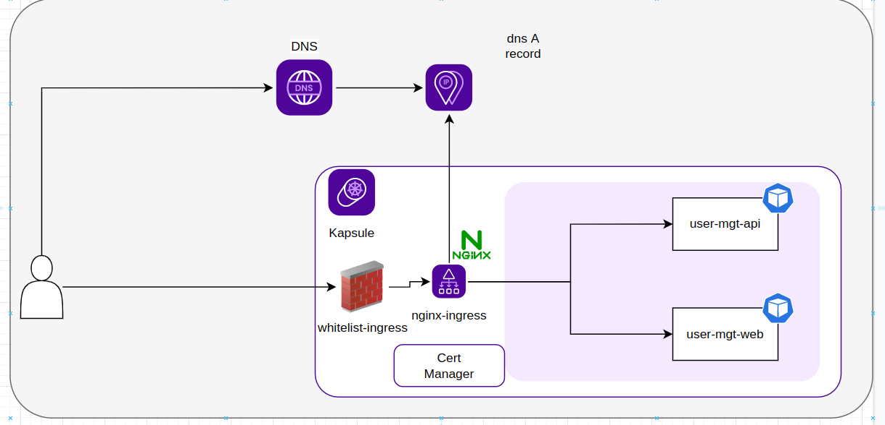
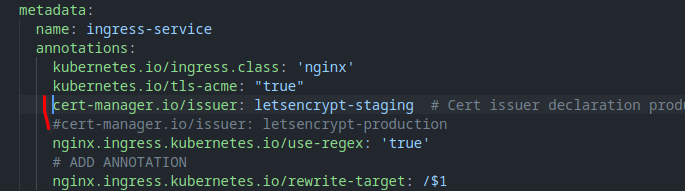

# Description
The main goal of this sample is to deploy Cert Manager to be able to autogenerate certificate in front of the ingress Load Balancer.
1. Terraform will be used to deploy the following aspects :
- Kubernetes Cluster 
- Cert Manager (with helm chart see [here](./infrastructure/cert-manager.tf))
- Ingress Nginx (with helm chart see [here](./infrastructure/ingress-nginx.tf))
- Kubernetes Dashboard (that will be used for debugging purpose with helm chart see [here](./infrastructure/kubernetes-dashboard.tf))

2. For the demonstration, we will use the user-management app that allows the creation of a user through react based interface that interact with and api implemented in nodeJS which store data within a mongo db database .
The yaml file for the application deployment can be found [here](./k8s/user-mgt-app.yaml)
3. The ingress configuration for the app can be found [here](./k8s/user-mgt-app-ingress-service.yaml), it redirects flow to the right cluster service regarding the path
4. The Kube config will be automatically deployed on the user desktop so it does not need to download it from Kubernetes Console.
5. The Kubernetes Dashboard can be used to see what happened within your cluster (POD Allocation) by using kubetcl proxy then
http://localhost:8001/api/v1/namespaces/kubernetes-dashboard/services/https:kubernetes-dashboard:https/proxy

**NB: External DNS for scaleway provider is still in beta so we will use terraform to create the record**

# Deployment
## Infrastructure Prerequisites
1. Open infrastructure folder
2. Rename terraform.tfvars.template -> terraform.tfvars (Fill it with your properties domain , allowed ip , ...)
3. Rename provider.tf.template -> provider.tf (Fill it with your Scaleway Credentials)
2. terraform init
3. terraform apply -auto-approve
## Application Deployment
1. kubectl apply -f k8s

**NB**: By default, only the Lets Encrypt staging issuer is enabled . The production issuer can be enabled by uncommenting the associated line within the 
[user-mgt-app-ingress-service.yaml](./k8s/user-mgt-app-ingress-service.yaml)

# Cleanup
1. Open infrastructure folder
2. terraform destroy -auto-approve

Faire un schema explicatif
kubeconfig durectement téléchargé pour interagir avec le cluster
Dashboard Access

# Resources
- https://mricher.fr/post/scaleway-kapsule-howto-ingress-nginx-cert-manager/
- https://github.com/kubernetes/ingress-nginx/blob/main/docs/user-guide/nginx-configuration/annotations.md
